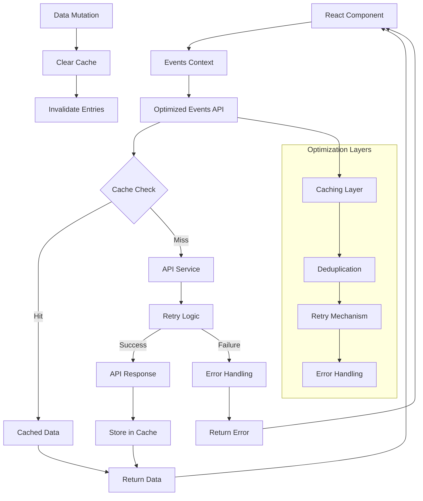
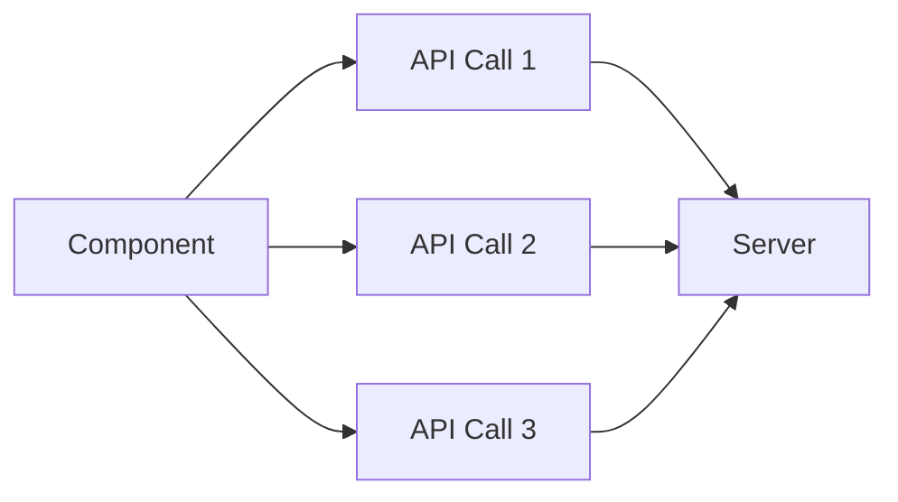
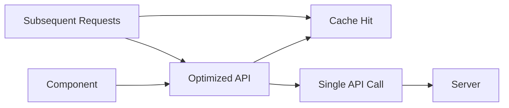

# Server Call Architecture Diagram

This diagram shows the flow of server calls through the optimized architecture.



## Component Descriptions

### React Components

- **EventDetails Page**: Uses optimized API for fetching event data
- **MyEvents Page**: Uses optimized API for fetching user events
- **HomePage**: Uses optimized API for fetching all events

### Context Layer

- **EventsProvider**: Centralized event management with optimized fetching

### API Layer

- **eventsOptimized.ts**: Main API service with all optimizations
- **api.ts**: Base API configuration with interceptors

### Optimization Components

1. **Caching Layer**: In-memory cache with TTL
2. **Deduplication**: Prevents duplicate simultaneous requests
3. **Retry Mechanism**: Exponential backoff for failed requests
4. **Error Handling**: Enhanced error reporting and logging

## Data Flow

### Read Operations

```
Component → Context → Optimized API → Cache Check
                                      ↳ Hit → Return Cached Data
                                      ↳ Miss → API Service →
                                               Retry Logic →
                                               API Call →
                                               Store in Cache →
                                               Return Data
```

### Write Operations

```
Component → Context → Optimized API →
                     API Service →
                     API Call →
                     Clear Cache →
                     Return Result
```

## Benefits Visualization

### Before Optimization



### After Optimization


