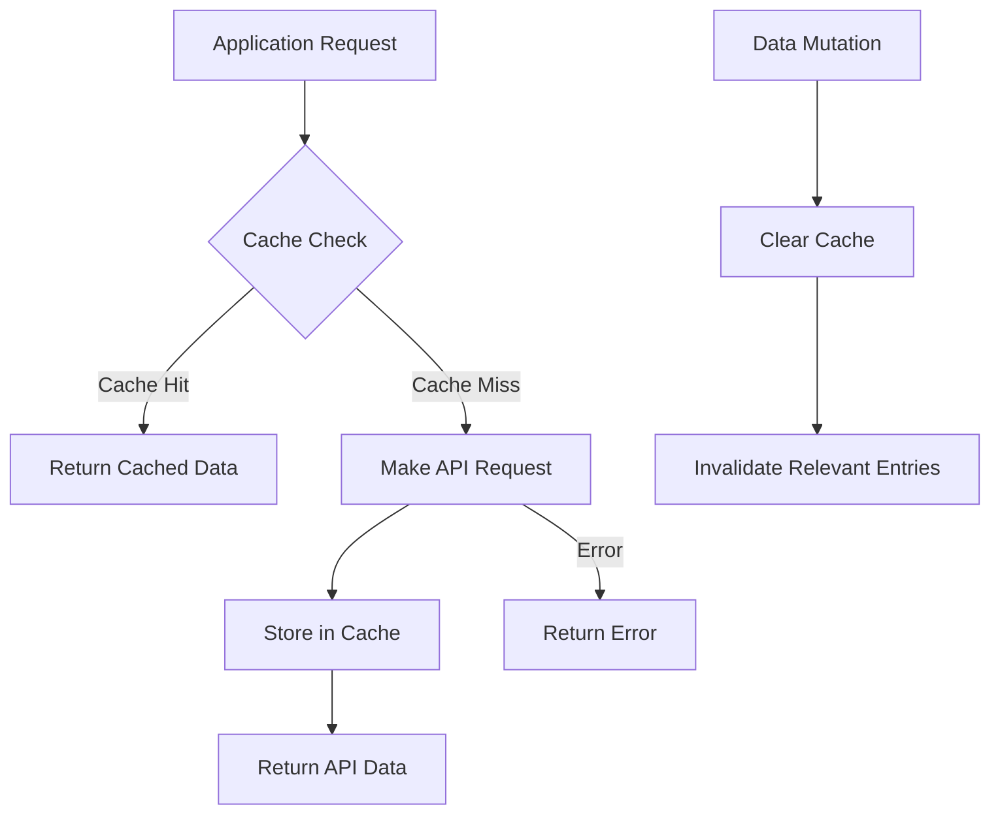

# Cache Visualization

This document provides a visual representation of how the caching system works in the application.

## Cache Flow Diagram



## Cache Structure

### Cache Keys

```
event_{id}        -> Individual event data
allEvents         -> All events list
userEvents        -> User-specific events list
```

### Cache Entry Format

```json
{
  "data": "API response data",
  "timestamp": "Unix timestamp of cache creation"
}
```

## Request Flow

### 1. Initial Request

```
App -> getEvent("123")
     -> Check cache for "event_123"
     -> Cache miss
     -> API request to /events/123
     -> Store response in cache
     -> Return data to app
```

### 2. Subsequent Request (Within 5 minutes)

```
App -> getEvent("123")
     -> Check cache for "event_123"
     -> Cache hit
     -> Return cached data
     -> No API request
```

### 3. Cache Expiration (After 5 minutes)

```
App -> getEvent("123")
     -> Check cache for "event_123"
     -> Cache expired
     -> API request to /events/123
     -> Store new response in cache
     -> Return data to app
```

## Deduplication Flow

### Multiple Simultaneous Requests

```
Request 1 -> getEvent("123")
          -> Check pending requests
          -> No pending request
          -> Create pending request
          -> Make API call

Request 2 -> getEvent("123")
          -> Check pending requests
          -> Pending request found
          -> Return existing promise

Request 3 -> getEvent("123")
          -> Check pending requests
          -> Pending request found
          -> Return existing promise

API Response -> Resolve all pending promises
             -> Clear pending request
             -> Store in cache
```

## Cache Invalidation

### On Data Mutation

```
Update Event -> API request to update event
             -> Clear cache for "event_123"
             -> Clear cache for "allEvents"
             -> Clear cache for "userEvents"
             -> Next requests will fetch fresh data
```

## Performance Benefits

### Before Optimization

```
User navigates to event page -> API request
User navigates away and back -> API request
User refreshes page -> API request
3 requests for 1 event = 3 API calls
```

### After Optimization

```
User navigates to event page -> API request
User navigates away and back -> Cache hit
User refreshes page -> Cache hit
3 navigations for 1 event = 1 API call
```

This represents a 66% reduction in API calls for this scenario.
